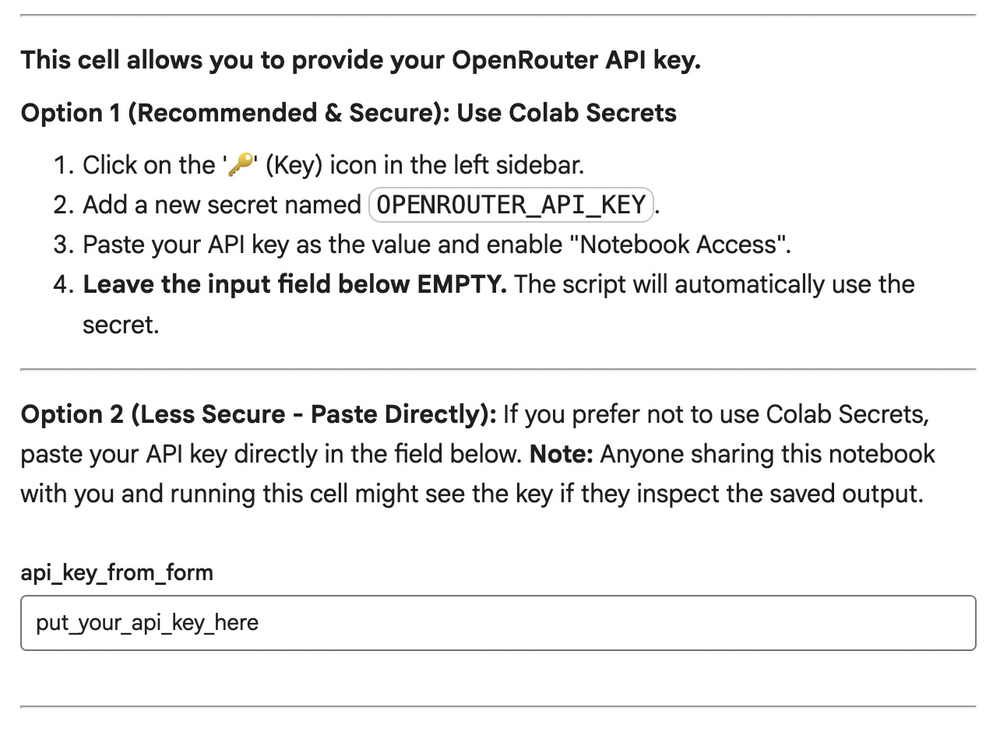

[🇮🇹 Italiano](README.it.md) | [🇺🇸 English](README.md)

# Clusterize & Measure (Advanced SEO Tools 2025 Special)

Notebook for clustering and automatic evaluation of textual data using LLM (Large Language Model) models and OpenRouter API, designed to run on Google Colab.

The meaning of this tool will be revealed during Search Connect 2025!

# Table of Contents

- [Clusterize & Measure (Advanced SEO Tools 2025 Special)](#clusterize--measure-advanced-seo-tools-2025-special)
- [Table of Contents](#table-of-contents)
  - [✨ Main Features](#-main-features)
  - [⁉️ How does the test work?](#️-how-does-the-test-work)
  - [Requirements](#requirements)
  - [🚀 How to use the notebook](#-how-to-use-the-notebook)
    - [1. Upload the notebook to Google Colab](#1-upload-the-notebook-to-google-colab)
    - [2. Enter the OpenRouter API key](#2-enter-the-openrouter-api-key)
    - [3. Upload the input CSV file](#3-upload-the-input-csv-file)
    - [4. Configure Service Prompts](#4-configure-service-prompts)
    - [5. Configure parameters](#5-configure-parameters)
    - [6. Start processing](#6-start-processing)
  - [📂 Project Structure](#-project-structure)
  - [Share with the community](#share-with-the-community)
  - [ℹ️ Notes](#ℹ️-notes)
  - [✍️ Credits](#️-credits)
  - [License](#license)
  - [How to contribute](#how-to-contribute)
  - [FAQ](#faq)
    - [Why does the service analyze one query at a time?](#why-does-the-service-analyze-one-query-at-a-time)

## ✨ Main Features

- **Clustering** of textual data via LLM models.
- **Semantic similarity evaluation** between model output and ground truth.
- **Simple CSV input/output management**.
- **Direct compatibility with Google Colab** (file upload, secrets management, etc.).
- **Messages and interface completely in English**.

## ⁉️ How does the test work?

1. An SEO expert provides a list of queries they have categorized into clusters and sub-clusters.
2. A prompt is defined to simulate the categorization work using an LLM, as if it were an SEO expert.
3. A second LLM model analyzes the answer of the first one, semantically evaluating the "similarity" to the original. On a scale from 0 to 100, where 100 is identical, 0 represents complete dissonance.
4. At the end of the process, the service saves all results in a CSV file, containing the original data, data obtained from the first LLM, and the similarity coefficient.
5. The rest will be explained at AST 2025 or Search Connect 2025 (if they accept me).

## Requirements

- A Google account to run Colab (click the link at the top of the page).
- An OpenRouter account to create an API key: https://openrouter.ai/
  - OpenRouter is a service that acts as an intermediary between a huge number of LLM providers. You create an account (which is free), load credit (I believe the minimum is 5 dollars), and then consume credit based on usage. There is no recurring subscription.
  - Depending on the model, the cost fluctuates between 1 cent (USD) per 100 queries to 10 cents per 100 queries.

## 🚀 How to use the notebook

### 1. Upload the notebook to Google Colab

- Go to [Google Colab](https://colab.research.google.com/).
- Click on "File" → "Upload notebook" and select `clusterizza_e_misura.ipynb` from your computer.

### 2. Enter the OpenRouter API key

- Follow the instructions in the first cell of the notebook to enter your API key (via Colab Secrets or direct field).

### 3. Upload the input CSV file

- Use the dedicated section to upload your CSV file.
- The file must contain at least the columns `input` and `ground_truth`.
- Then right-click "copy path".
- If you need an example, select "copy path" on `test-30-martino.csv` (great if you need to configure the document with your queries).

### 4. Configure Service Prompts

In this cell, you define the 2 prompts that will be used by the service.

- The first prompt performs categorization, so you need to tell the model what considerations to adopt to cluster a query and provide examples of how to do it.
- The second prompt applies a semantic evaluation on the result obtained from the first prompt, comparing it with the "truth" (ground_truth) provided in the CSV file.

### 5. Configure parameters

- Set the models to use and other parameters according to your needs.
- Paste the CSV file path into the corresponding field.

### 6. Start processing

- Execute the notebook cells one by one (Shift+Enter) following the suggested order.
- At the end, download the results from the "results" section.

## 📂 Project Structure

- `clusterizza_e_misura.ipynb` — Main notebook, ready for use on Colab.
- `README.md` — This file.
- `test-30-martino.csv` - Example file.
- `screenshots` - Images for these instructions.

## Share with the community

If this project was useful to you, consider sharing it with other SEO and AI professionals or enthusiasts!
Spreading open source tools helps the whole community grow.

## ℹ️ Notes

- The notebook is designed to run solely on Google Colab. Running in a local environment requires manually installing dependencies and adapting some features (file upload, secrets management, etc.). For my experiment they are not necessary, but if you want to run it locally you must add them.
- For assistance or bug reporting, open an issue on GitHub.

---

## ✍️ Credits

- Curated by [Andrea Scarpetta](https://www.andreascarpetta.it), part of the [Search Foundry](https://www.searchfoundry.pro) collective.
- Example file curated by [Martino Mosna](https://www.martinomosna.com).

## License

This project is distributed under the [MIT](LICENSE) license.

## How to contribute

If you want to contribute, propose improvements, or report problems (and don't know how to use github issues), you can contact me directly on [LinkedIn](https://www.linkedin.com/in/andreascarpetta).

## FAQ

### Why does the service analyze one query at a time?

> To also measure the reliability of LLM providers. A "batch" job of 30-40 queries at a time was feasible, but OpenRouter calls different providers (if a choice is available), almost always selecting the most reliable one. I also wanted to measure when the call to providers failed. And in that case, the query gets a "zero" grade.

### Why i can't get the complete keyword set ?

> To avoid "overfitting". All the main models are trained on scraped web data. Sooner or later the keyword set with the ground truths, would be available for those clankers to be processed, therefore making the whole test pointless.

---
© 2025 Andrea Scarpetta - Founding member of Search Foundry

Made with ❤️, 🤖 AI and [Jupyter](https://jupyter.org/) · Powered by [OpenRouter](https://openrouter.ai/)

This project is released for educational and experimental purposes. No guarantee of operation in production.

If it was useful, leave a ⭐️ on GitHub!
