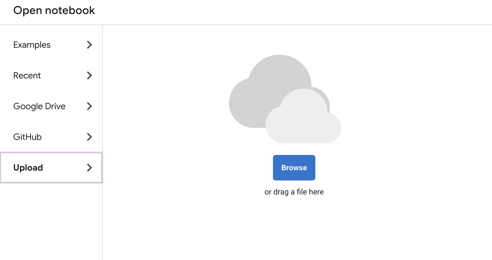
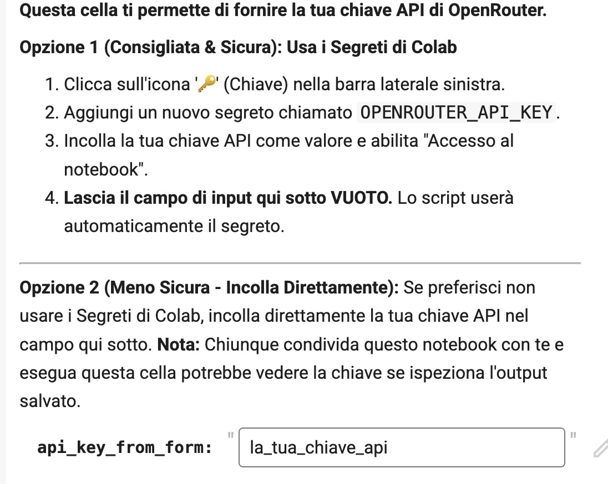
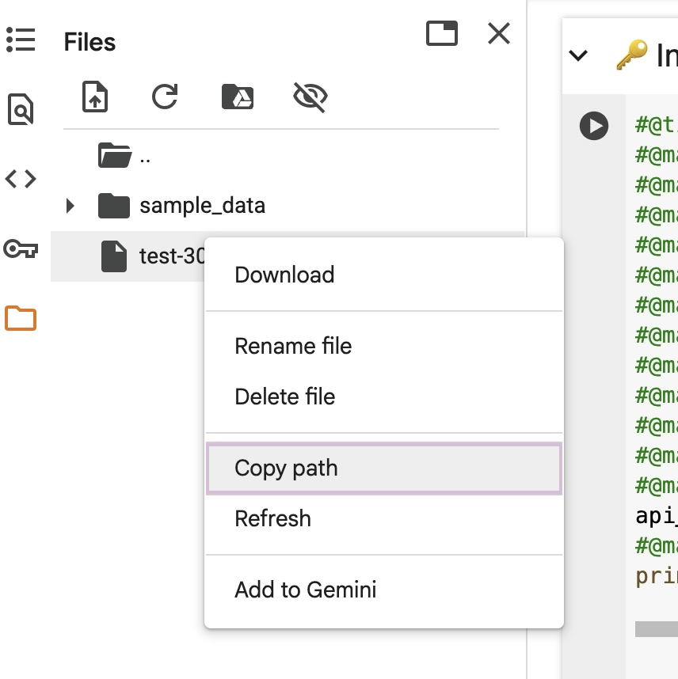
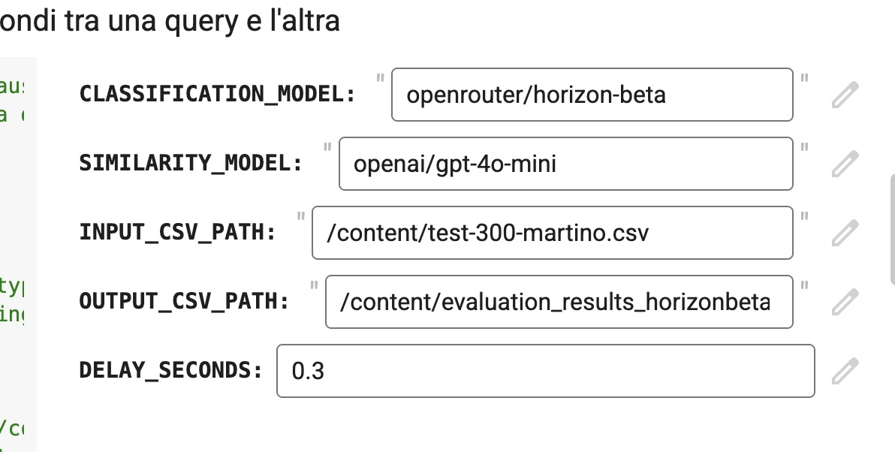
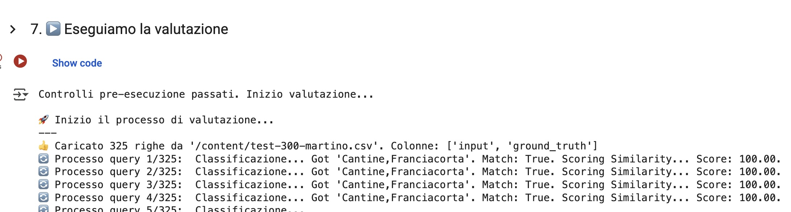

# Clusterizza & Misura (Speciale Advanced SEO Tools 2025)

Notebook per il clustering e la valutazione automatica di dati testuali tramite modelli LLM (Large Language Model) e API OpenRouter, pensato per essere eseguito su Google Colab.

Il significato di questo tool sarà rivelato durante Search Connect 2025! 

# Tabella dei contenuti

- [Clusterizza \& Misura (Speciale Advanced SEO Tools 2025)](#clusterizza--misura-speciale-advanced-seo-tools-2025)
- [Tabella dei contenuti](#tabella-dei-contenuti)
  - [✨ Funzionalità principali](#-funzionalità-principali)
  - [⁉️ Come funziona il test?](#️-come-funziona-il-test)
  - [Requisiti](#requisiti)
  - [🚀 Come utilizzare il notebook](#-come-utilizzare-il-notebook)
    - [1. Carica il notebook su Google Colab](#1-carica-il-notebook-su-google-colab)
    - [2. Inserisci la chiave API di OpenRouter](#2-inserisci-la-chiave-api-di-openrouter)
    - [3. Carica il file CSV di input](#3-carica-il-file-csv-di-input)
    - [4. Configura i Prompt di servizio](#4-configura-i-prompt-di-servizio)
    - [5. Configura i parametri](#5-configura-i-parametri)
    - [6. Avvia l’elaborazione](#6-avvia-lelaborazione)
  - [📂 Struttura del progetto](#-struttura-del-progetto)
  - [Condividi con la community](#condividi-con-la-community)
  - [ℹ️ Note](#ℹ️-note)
  - [✍️ Crediti](#️-crediti)
  - [Licenza](#licenza)
  - [Come contribuire](#come-contribuire)
  - [FAQ](#faq)
    - [Perchè il servizio analizza una query alla volta ?](#perchè-il-servizio-analizza-una-query-alla-volta-)

## ✨ Funzionalità principali

- **Clustering** di dati testuali tramite modelli LLM.
- **Valutazione della similarità semantica** tra output del modello e ground truth.
- **Gestione semplice di input/output CSV**.
- **Compatibilità diretta con Google Colab** (upload file, gestione segreti, ecc.).
- **Messaggi e interfaccia completamente in italiano**.

## ⁉️ Come funziona il test? 

1. un SEO esperto fornisce un elenco di query che ha categorizzato in cluster e sub-cluster
2. viene definito un prompt per simulare il lavoro di categorizzazione usando un LLM, come se fosse un esperto SEO
3. un secondo modello di LLM analizza la risposta del primo, valutando semanticamente la "somiglianza" rispetto all'originale. In una scala da 0 a 100, dove 100 è identico, 0 rappresenta una completa dissonanza.
4. Alla fine del processo, il servizio salva tutti i risultati in un file CSV, contentente i dati originali, i dati ottenuti dal primo LLM e il coefficiente di similarità.
5. Il resto sarà spiegato ad AST 2025 o al Search Connect 2025 (se mi accettano)

## Requisiti

- un account google su cui far girare il colab (clicca il link in cima alla pagina)
- un account openrouter con cui creare una api key: https://openrouter.ai/
  - Openrouter è un servizio che fa da intermediario tra un numero smisurato di fornitori di modelli LLM. Si crea un account (che è gratuito), si carica un credito (il minimo credo che sia 5 dollari) e poi si consuma il credito sulla base dell'utilizzo. Non c'è un abbonamento ricorrente.
  - a seconda del modello il costo oscilla tra 1 centesimo ogni 100 query a 10 centesimi ogni 100 query.

## 🚀 Come utilizzare il notebook

### 1. Carica il notebook su Google Colab

- Vai su [Google Colab](https://colab.research.google.com/).
- Clicca su “File” → “Carica notebook” e seleziona `clusterizza_e_misura.ipynb` dal tuo computer.

### 2. Inserisci la chiave API di OpenRouter

- Segui le istruzioni nella prima cella del notebook per inserire la tua chiave API (tramite Colab Secrets o campo diretto).

### 3. Carica il file CSV di input

- Utilizza la sezione dedicata per caricare il tuo file CSV.
- Il file deve contenere almeno le colonne `input` e `ground_truth`.
- poi seleziona col tasto detro "copia percorso"
- se ti serve un esempio seleziona "copia percorso" su test-30-martino.csv (ottimo se devi configurare il documento con le tue query)

### 4. Configura i Prompt di servizio

In questa cella definisci i 2 prompt che saranno usati dal servizio.

- il primo prompt effettua la categorizzazione, per cui devi dire al modello con quali considerazioni adottare per clusterizzare una query e fornire degli esempi di come effettuarla.
- il secondo prompt applica una valutazione semantica sul risultato ottenuto dal primo prompt, confrontandolo con la "verità" (ground_truth) fornita nel file csv.

### 5. Configura i parametri

- Imposta i modelli da utilizzare, gli altri parametri secondo le tue esigenze.
- incolla il percorso del file csv nel campo corrispondente

### 6. Avvia l’elaborazione

- Esegui le celle del notebook una alla volta (Shift+Invio) seguendo l’ordine suggerito.
- Al termine, scarica i risultati dalla sezione “risultati”.

## 📂 Struttura del progetto

- `clusterizza_e_misura.ipynb` — Notebook principale, pronto per l’uso su Colab.
- `README.md` — Questo file.
- `test-30-martino.csv` - file di esempio  
- `screenshots` - immagini di queste istruzioni
  

## Condividi con la community

Se questo progetto ti è stato utile, considera la possibilità di condividerlo con altri professionisti o appassionati di SEO e AI!  
Diffondere strumenti open source aiuta tutta la community a crescere.

## ℹ️ Note

- Il notebook è pensato per essere eseguito unicamente su Google Colab. L’esecuzione in ambiente locale richiede l’installazione manuale delle dipendenze e l’adattamento di alcune funzionalità (upload file, gestione segreti, ecc.). Per il mio esperimento non sono necessarie, ma se volete eseguirlo localmente dovete aggiungerle.
- Per assistenza o segnalazione bug, apri una issue su GitHub.

---

## ✍️ Crediti

- A cura di [Andrea Scarpetta](https://www.andreascarpetta.it), parte del collettivo [Search Foundry](https://www.searchfoundry.pro)

- File di esempio curato da [Martino Mosna](https://www.martinomosna.com).

## Licenza

Questo progetto è distribuito con licenza [MIT](LICENSE).

## Come contribuire

Se vuoi contribuire, proporre miglioramenti o segnalare problemi (e non sai usare le issue di github), puoi contattarmi direttamente su [LinkedIn](https://www.linkedin.com/in/andreascarpetta).

## FAQ

### Perchè il servizio analizza una query alla volta ? 

> per misurare anche l'attendibilità dei provider di LLM. Un lavoro in "batch" da 30-40 query alla volta era fattibile, ma openrouter chiama diversi provider (se disponibile una scelta) selezionando quasi sempre quello più attendibile. Ho voluto misurare anche quando la chiamata ai provider non andava a buon fine. E in quel caso la query ottiene un voto "zero".

---
© 2025 Andrea Scarpetta - Founding member of Search Foundry

Made with ❤️, 🤖  AI and [Jupyter](https://jupyter.org/) · Powered by [OpenRouter](https://openrouter.ai/)

Questo progetto è rilasciato a scopo didattico e sperimentale. Nessuna garanzia di funzionamento in produzione.

Se ti è stato utile, lascia una ⭐️ su GitHub!

